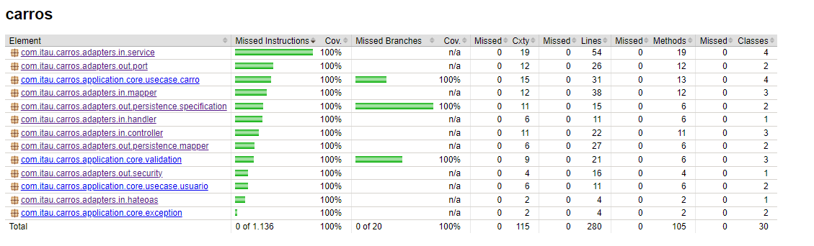

# Java Spring Boot RESTful API - Junior Case

Este projeto representa o desenvolvimento de uma API RESTful utilizando Spring Boot, focado em práticas modernas de desenvolvimento, integração e entrega de software. Com a adoção de tecnologias e ferramentas chave, busquei garantir qualidade, performance e escalabilidade.

## Tecnologias e Ferramentas Utilizadas

As principais tecnologias que fundamentam este projeto incluem:

- **Java**: Linguagem de programação principal.
- **MySql**: Sistema de gerenciamento de banco de dados.
- **Docker**: Plataforma de contêineres para facilitar a implantação e execução.
- **Swagger**: Ferramenta para documentação e design de APIs RESTful.
- **JaCoCo**: Framework para análise de cobertura de código.
- **Spring Security**: Estrutura de segurança que oferece autenticação e autorização robustas.
- **JWT (JSON Web Token)**: Padrão para a criação de tokens de acesso que permitem a transmissão segura de informações entre partes como um objeto JSON. Usado para autenticar e autorizar usuários na API sem manter estados no servidor.

## Infraestrutura de Banco de Dados com Flyway

Utilizei o Flyway como ferramenta de Infrastructure as Code (IaC) para provisionar e gerenciar a infraestrutura do banco de dados de forma automatizada e versionada.

## Containerização com Docker


A aplicação e o banco de dados foram containerizados com Docker, utilizando Docker Compose para o provisionamento automatizado, facilitando a implantação e o gerenciamento.

## Documentação com Swagger

Para facilitar os testes e proporcionar uma documentação interativa da API, integrei o Swagger ao projeto.

**Acessando a documentação**: Ao executar a aplicação no docker, a documentação do Swagger estará disponível em `http://localhost/swagger-ui/index.html#/`.

## Cobertura de Testes com JaCoCo



A integração do JaCoCo ao projeto permite mapear a cobertura de testes de forma visual, evidenciando a porcentagem do código coberto por testes.

## Dinamismo nas Respostas com HATEOAS

```json
{
  "id": 1,
  "chassi": "9BWZZZ377VT024221",
  "name": "Lamborghini Urus",
  "manufacturer": "Automobili Lamborghini S.P.A.",
  "year": 2021,
  "color": "white",
  "status": "ACTIVATED",
  "placa": "OPA3339",
  "links": [
    {
      "rel": "self",
      "href": "http://localhost:8888/api/carro/1"
    },
    {
      "rel": "carros",
      "href": "http://localhost:8888/api/carro"
    }
  ]
}
```
A implementação do HATEOAS enriquece as respostas da API com links detalhados, promovendo uma interação mais rica e dinâmica.

## Endpoints para gerenciamento de carros
> **Nota:** Os endpoints abaixo não podem ser acessados sem seguir o passo a passo da [seção de Autorização](#autorização-com-spring-security).


Os endpoints disponíveis permitem operações CRUD básicas para o gerenciamento de cadastros de carros. Eles são projetados para facilitar a consulta, listagem, criação, atualização e exclusão lógica dos registros de carros. Cada operação é acessível através de um endpoint específico, conforme detalhado abaixo:

- `GET /api/carro/{id}`: Consulta um cadastro de carro específico pelo ID. Retorna os detalhes do carro, juntamente com links HATEOAS para operações relacionadas.

- `GET /api/carro`: Lista todos os cadastros de carros disponíveis. Cada item na lista inclui links HATEOAS para detalhamento e outras operações relacionadas.

- `POST /api/carro`: Permite a criação de um novo cadastro de carro. O corpo da requisição deve conter os detalhes do carro a ser cadastrado.

- `PUT /api/carro/{id}`: Atualiza o status de um cadastro de carro existente.

- `DELETE /api/carro/{id}`: Realiza a exclusão lógica de um cadastro de carro, identificado pelo ID. O registro não é removido fisicamente do banco de dados, mas é marcado de forma a não ser mais listado ou consultado.

Cada um desses endpoints é protegido e requer autenticação e autorização adequadas, garantindo que apenas usuários autorizados possam executar essas operações.

## Executando o Projeto

Para colocar a aplicação em funcionamento:

1. Clone o repositório e navegue até o diretório com o `pom.xml`.
2. Execute `mvn clean package -DskipTests` para empacotar a aplicação.
3. Navegue até o diretório com o `docker-compose.yml` e execute `docker compose up -d --build` para iniciar a aplicação.

## Autorização com Spring Security

Para assegurar a segurança da API, foi implementado o **Spring Security**, adicionando uma camada de autorização para as requisições.


### Passo a Passo para Autorização

1. **Cadastro de Novo Usuário:** Primeiro, cadastre um novo usuário acessando o endpoint `POST /api/cadastro` através do Swagger UI. Preencha os detalhes necessários como nome de usuário, senha e email no corpo da requisição.

2. **Login:** Após o cadastro, faça login utilizando o endpoint `POST /api/login`. Insira as credenciais do usuário (nome de usuário e senha) para receber um token de acesso no corpo da resposta.

3. **Utilizar o Token de Acesso:** Com o token de acesso obtido, você pode autorizar subsequentes requisições à API. No Swagger UI, clique no botão "Authorize" e insira o token de acesso precedido por "Bearer ".

4. **Acesso aos Endpoints Protegidos:** Agora você está autorizado a acessar os endpoints protegidos da API. Execute as operações desejadas utilizando o Swagger UI, com o token de acesso fornecendo a devida autorização.

> **Nota:** Token valido apenas por duas horas, dado esse tempo o login deverá ser efetuado novamente para geração de um novo token.

## Diagrama de Classes


Elaborei um diagrama de classes para ilustrar a estrutura e o funcionamento da API de maneira clara.

**Visualização e Download**: O diagrama pode ser visualizado nesta documentação ou baixado para visualização no [draw.io](https://draw.io). Para baixar o diagrama, acesse este [link](https://github.com/AL3ZIN/Junior-Case-Spring-Boot-Restful-Api/blob/main/Java-Spring-Boot-RESTful-Api/docs/juniorCaseDiagram.drawio).


## Considerações Finais e Boas Práticas

Além das tecnologias destacadas, este projeto adotou diversas metodologias e práticas recomendadas, visando a qualidade, escalabilidade e manutenibilidade do código. Entre elas, destacam-se:

- **SOLID**: Princípios de design orientado a objetos que promovem um código mais limpo, escalável e suscetível a menos bugs. Estes princípios incluem responsabilidade única, aberto-fechado, substituição de Liskov, segregação de interfaces e inversão de dependência.
- **DDD (Domain-Driven Design)**: Abordagem para o desenvolvimento de software que coloca o foco no domínio do problema e na lógica de domínio central, facilitando a comunicação entre especialistas de domínio e desenvolvedores e criando um software mais coeso.
- **IoC (Inversão de Controle)**: Uma prática que reduz o acoplamento entre o código e suas dependências, transferindo a responsabilidade de criação de instâncias para um container ou framework, como o Spring Framework.
- **DI (Injeção de Dependência)**: Uma forma de IoC, onde as dependências são fornecidas a um objeto, em vez de serem construídas pelo próprio objeto, facilitando a testabilidade e manutenção.
- **Padrão Strategy**: Permite a seleção de um algoritmo em tempo de execução, tornando o software mais flexível e permitindo a mudança de comportamento de suas entidades.
- **Manipulação de Exceções**: Práticas para tratar erros de forma centralizada, permitindo que a aplicação lide com falhas de forma mais elegante e informe os usuários de forma adequada.
- **Respostas HTTP Detalhadas**: Implementação de respostas ricas em informações, proporcionando feedback claro para os consumidores da API sobre o resultado de suas requisições, incluindo sucesso, erro e dados retornados.

Essas práticas e metodologias são fundamentais para a construção de um software robusto, escalável e fácil de manter. Continuaremos a adotá-las e aperfeiçoá-las à medida que o projeto evolui.
